[](https://opensource.org/licenses/MIT)

# APS Generator

This tool provides a simple, user-friendly method to easily generate density-optimized APS layouts for [From The Depths](https://store.steampowered.com/app/268650/From_The_Depths/).

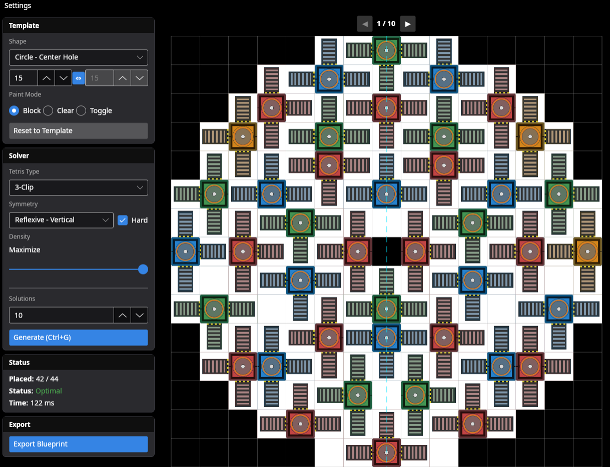

---

## Features

- Support for **3-clip, 4-clip, and 5-clip** APS tetris.
- Automatic turret layout templates (circle with/without center hole, rectangle, or fully custom).
- **Hard and soft symmetry** enforcement - rotational (90°/180°) and reflexive (vertical/horizontal/quadrants).
- **Blueprint file export** - export generated layouts directly to `.blueprint` prefab files for immediate use in-game, including bottom layer of ejectors and ammo intakes. Choose the resulting prefab height, mapped automatically to the respective blocks, and get total material cost and block count before exporting.

## New in version 2.0

- **Template cell painting** - use click-and-drag to paint blocked or clear cells for custom templates. Painting follows symmetry rules if enabled.
- **Multi-solution generation** - generate multiple distinct solutions for the same template.
- **Selectable target density** - choose a desired density target to have the solver aim for, instead of just the optimal solution.
- **Experimental early stop heuristic** for faster solving (trades a small amount of optimality for significantly reduced solve time in some cases).
- **Fixes for 5-clip and rotational symmetry** - 5-clip now properly optimizes for maximum loaders/clips, and rotational symmetry (especially 90°) is actually rotationally symmetric.
- **Max time limit and cancellation** - set a maximum time limit for solving, and cancel long-running solves if you notice a mistake in your parameters.
- **Persistent settings** - settings are now saved and loaded from a config file in the app data folder.

---

## Installation

Releases are **self-contained** - no .NET runtime installation required.

#### Windows

1. Download `APS-Generator-{version}-windows-x64.zip` from the [latest release](https://github.com/trk20/APS-Generator/releases).
2. Extract the contents to a folder.
3. Run `ApsGenerator.UI.exe`.
4. When Windows shows "Windows protected your PC", click **More Info** → **Run Anyway**.

| _More Info_                                                 | _Run Anyway_                                                |
| ----------------------------------------------------------- | ----------------------------------------------------------- |
| 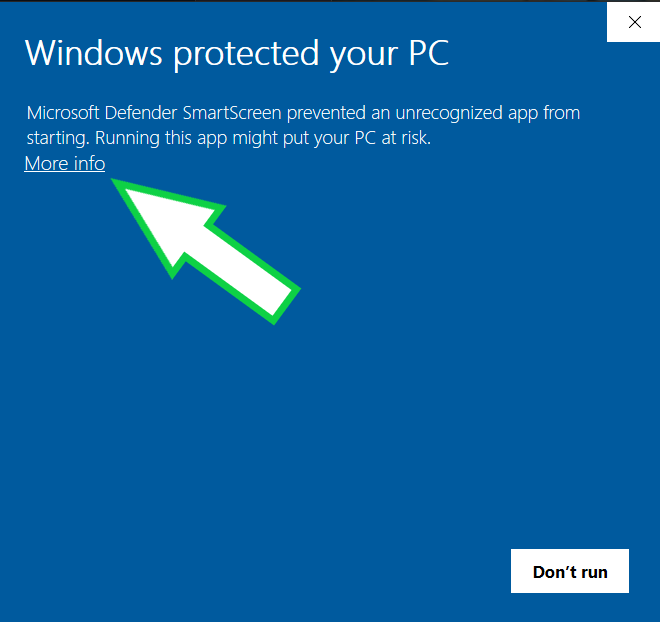 | 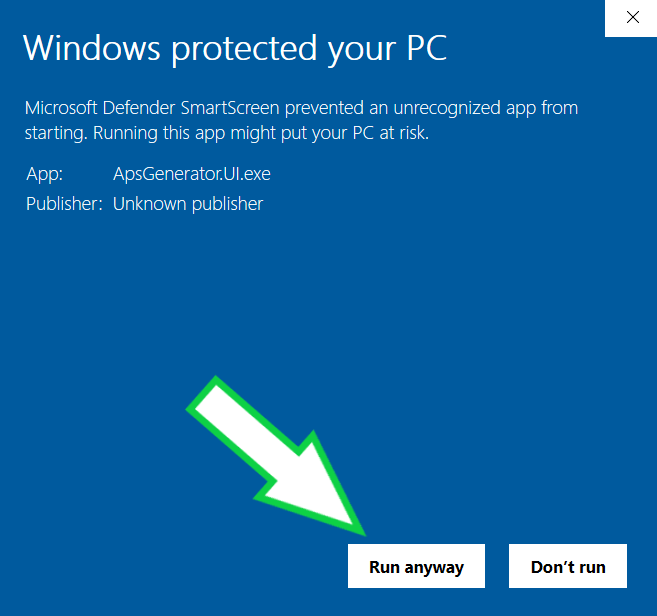 |

5. Done - move the folder anywhere and/or create a shortcut to the exe.

> **Why does Windows block the program?**
> The executable is unsigned - it doesn't have a certificate identifying its publisher. This is harmless; Windows just can't verify the source automatically.

#### Linux

1. Download `APS-Generator-{version}-linux-x64.zip` from the [latest release](https://github.com/trk20/APS-Generator/releases).
2. Extract the contents to a folder.
3. In a terminal, navigate to the folder and run:
   ```bash
   chmod +x ApsGenerator.UI && ./ApsGenerator.UI
   ```
4. Done - the program should open.

---

## Usage

#### Grid Editor

Paint (click-and-drag) or toggle cells between blocked and clear for fully custom templates.

Cells follow symmetry rules if enabled.

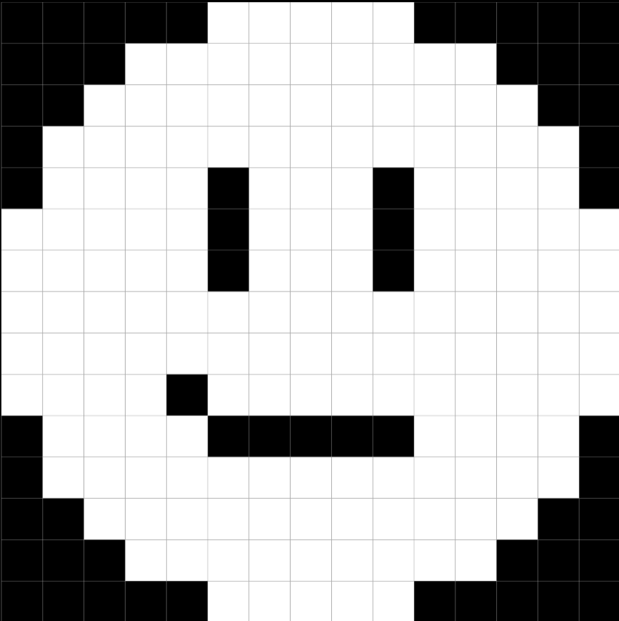

#### Template Options

- **Shape** - Choose template shape to start from (circle with/without center hole, rectangle).
- **Width/Height** - Adjust grid dimensions
- **Lock** - Maintain current aspect ratio when adjusting width/height.
- **Paint Mode** - Choose between painting blocked cells, clear cells, or individual cell toggling.
- **Reset to Template** - Reset the grid to the default pattern for the selected shape.

#### Solver Options

- **Tetris Type** - Choose between 3-clip, 4-clip, and 5-clip tetris.
- **Target Density/Maximize toggle** - Set a target density for the solver to aim for, or toggle to maximize density without a specific target.
- **Symmetry Type** - Options for enforcing solution symmetry: none, reflective (vertical/horizontal/quadrants), or rotational (90°/180°).
- **Soft vs Hard Symmetry** - Soft symmetry allows asymmetric placements where the symmetric counterpart would be invalid (off-grid, blocked, or self-intersecting). Hard symmetry discards these placements entirely.

| **Symmetry** | **Example Solution**                                        |
| ------------ | ----------------------------------------------------------- |
| None         | 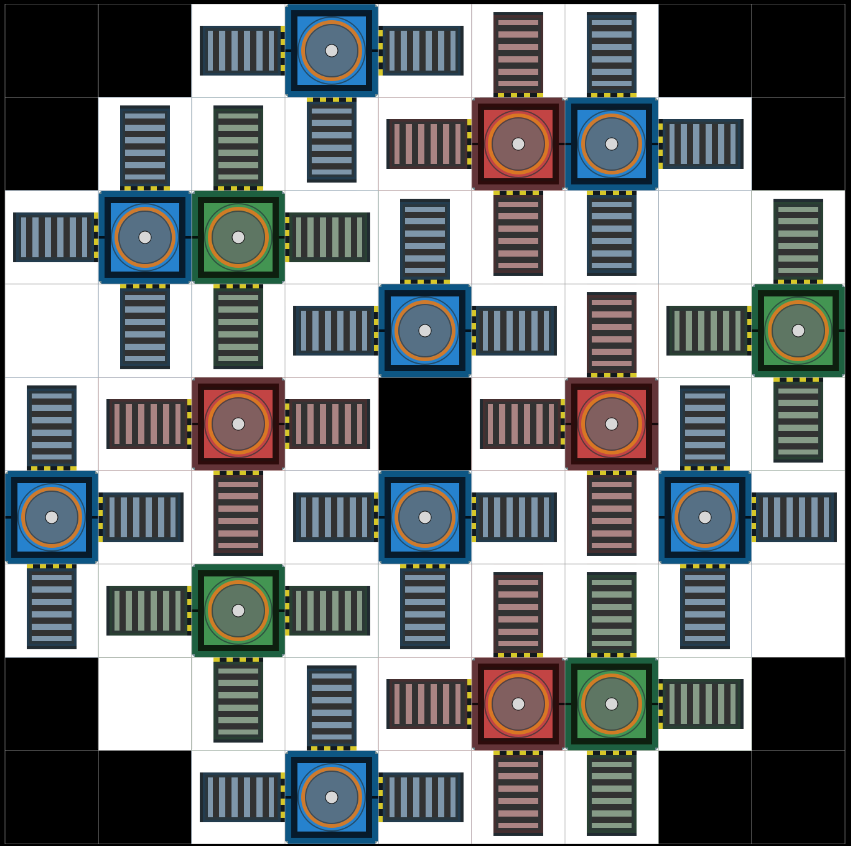               |
| Reflective   | 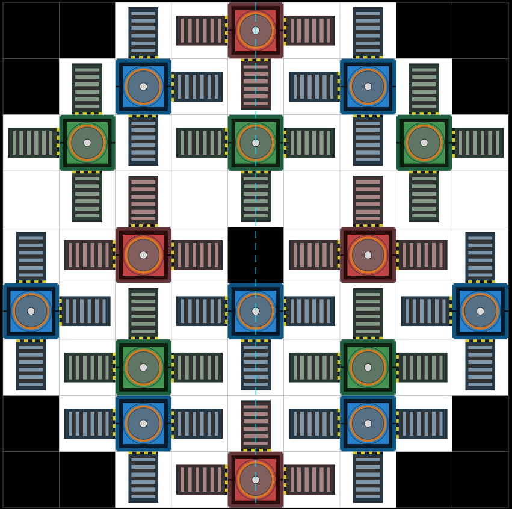   |
| Rotational   | 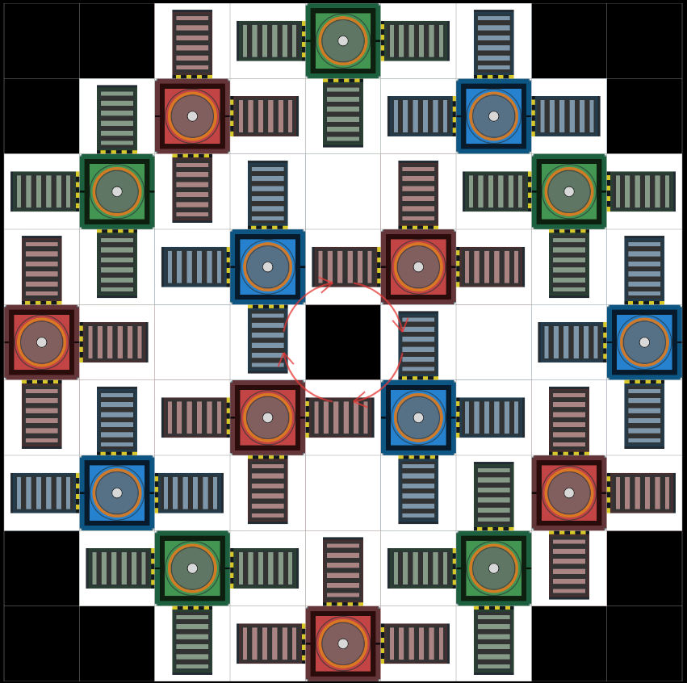 |

| **Soft vs Hard Symmetry** | **Example Solution**                                 |
| ------------------------- | ---------------------------------------------------- |
| Hard Symmetry             |  |
| Soft Symmetry             | 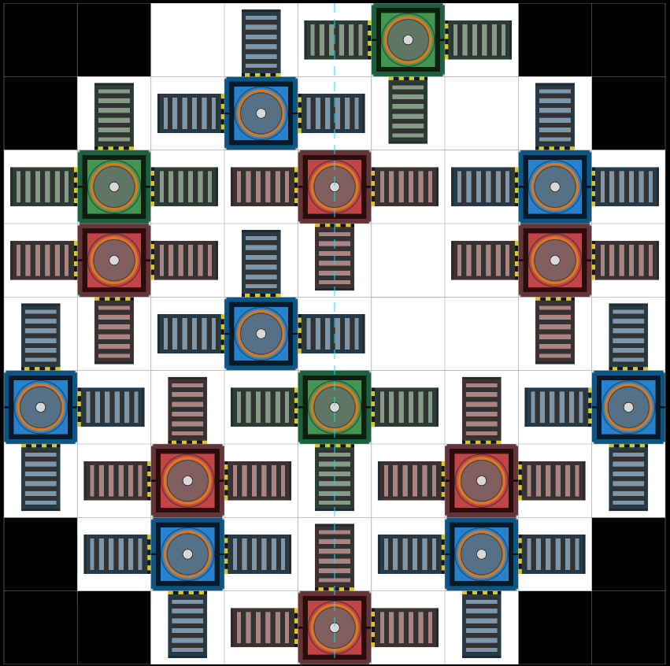      |

- **Number of Solutions** - Set how many distinct solutions the solver should generate before stopping. The solver will attempt to find multiple unique layouts that meet the specified parameters (note - this is significantly faster than generating multiple times, around ~50% extra time for 10 solutions instead of 1). After generating, you can cycle through the different solutions using the left and right arrow buttons above the result display. If less unique solutions exist than the number requested, the solver will return all unique solutions.

## Additional Settings

Access additional settings in the **Settings** menu:

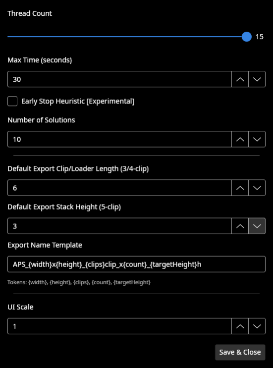

- **Thread Count** - Adjust the number of threads used for solving. More threads can speed up solving, especially for larger grids and higher clip counts, but will increase CPU usage.
- **Max Time** - Set a maximum time limit for the solver to run. If the solver exceeds this time, it will stop and return the best solution found so far.
- **Early Stop Heuristic** - Enable an experimental heuristic that can significantly reduce solve time in some cases by stopping early when a solution is found that meets certain criteria. In testing this reduced solve time by around 40% on average with a ~5% chance of missing the optimal solution.
- **Default Export Clip/Loader Length** - Set the default clip and loader lengths for exported blueprints using 3 and 4-clip tetris.
- **Default Export Stack Height** - Set the default stack height for exported blueprints using 5-clip tetris.
- **Export Name Template** - Set a default naming template for exported blueprints. You can use the following tokens in the name template, which will be replaced with the corresponding values from the generated solution:
  - `{width}` - Grid width
  - `{height}` - Grid height
  - `{clips}` - Tetris type (3, 4, or 5)
  - `{count}` - Block count in the solution
  - `{targetHeight}` - Target height for export

  Example: `APS_{width}x{height}_{clips}clip_{count}blocks_{targetHeight}h` → `APS_8x8_4clip_32blocks_5h.blueprint`

- **UI Scale** - Adjust the scale of UI elements for better visibility on high-DPI displays.

### Solve Status

While solving, the UI shows elapsed time and allows you to cancel the solve if you made a mistake on a long running solve.

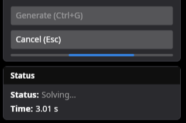

When the solver finishes, it shows the final cluster count, solution status, time taken, and enables the export button.

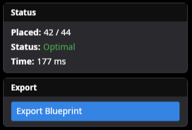

Statuses include:

- **Optimal** - The solver proved that the solution is optimal.
- **Likely Optimal** - The early stop heuristic was triggered, so the solver stopped before proving optimality. Small chance that a better solution exists.
- **Timed Out** - The solver exceeded the maximum time limit. The best solution found so far is returned, but it may not be optimal.
- **Cancelled** - The solve was cancelled prematurely by the user and no solution was returned.

### Exporting to FTD

When a solution is ready, press the **Export Blueprint** button to open the export dialog:

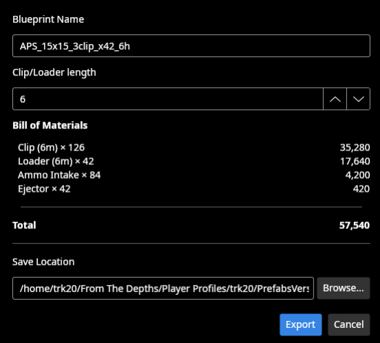

The export dialog shows total material cost. Select the clip/loader length for 3/4-clip or stack height for 5-clip, change the export name from the default template if you want, and press Export to save the `.blueprint` file. If this is the first time you're exporting, you may want to set the Save Location to your FTD prefab folder so the file is saved in the correct location for immediate use in-game (press browse and navigate to your FTD prefab folder).

`…/From The Depths/Player Profiles/{username}/PrefabsVersion2/`


The generated blueprint should now be available in-game. If you can't find it, check that it was saved in the correct prefab folder, and try refreshing the prefabs folder by clicking the refresh button in the FTD prefab browser.

---

## Tips

- Enforcing symmetry usually reduces compute time, at the slight risk of missing better asymmetric solutions.
- 3-clip solves much faster than 4-clip and 5-clip.
- Hard reflexive symmetry (Horizontal or Vertical) is recommended for 5-clip. Rotational symmetry is not recommended for 5-clip as it interferes with optimal arrangements.
- 180° rotational symmetry is recommended for 4-clip with the center hole template.
- If you find that you don't like the generated solution, try changing the number of solutions to generate and see if you get a different layout you prefer. Generating multiple solutions is much faster than generating multiple times and is guaranteed\* to give you unique layouts that meet the same parameters.

> \* : Can produce the same solution in some cases when target density is set to less than 100% - otherwise, all solutions will always be unique.</br>
> If less unique solutions exist than the number requested, the solver will return all unique solutions and stop.

---

## Contributing

Contributions are welcome!

- **Report Issues:** Open an issue on the [GitHub Issues tab](https://github.com/trk20/APS-Generator/issues) with as much detail as possible.
- **Submit Pull Requests:**
  1. Fork the repository.
  2. Create a branch for your changes.
  3. Make and commit your changes.
  4. Open a PR against the main branch with a clear description.

For development, you'll need .NET 10 SDK and familiarity with [Avalonia UI](https://docs.avaloniaui.net/) - the project uses Avalonia 11 for its cross-platform desktop UI.

## Acknowledgements

- Thanks to the developers of [CryptoMiniSat](https://github.com/msoos/cryptominisat) especially [@msoos](https://github.com/msoos) for their powerful SAT solver, which APS Generator uses for the bulk of the heavy computational lifting. The pull request containing modifications I needed for certain features was merged, so this project now points to the main CryptoMiniSat repo :)
- Thanks to **sascha** on Stack Overflow for their [answer on a polyomino grid-packing question](https://stackoverflow.com/a/47934736) that served as the basis for the core solving logic.

## License

This project is licensed under the MIT License - see the [LICENSE](LICENSE) file for details.
